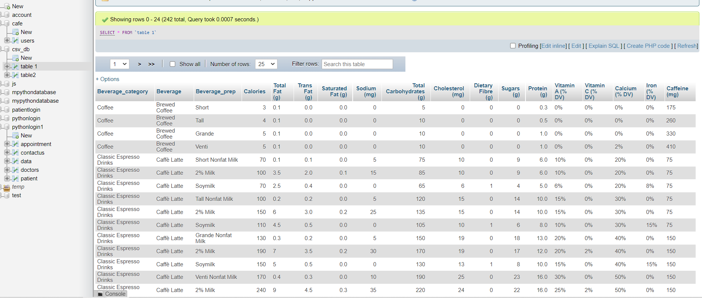
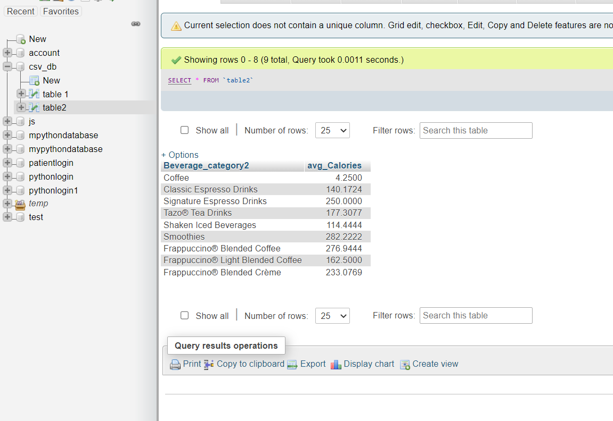
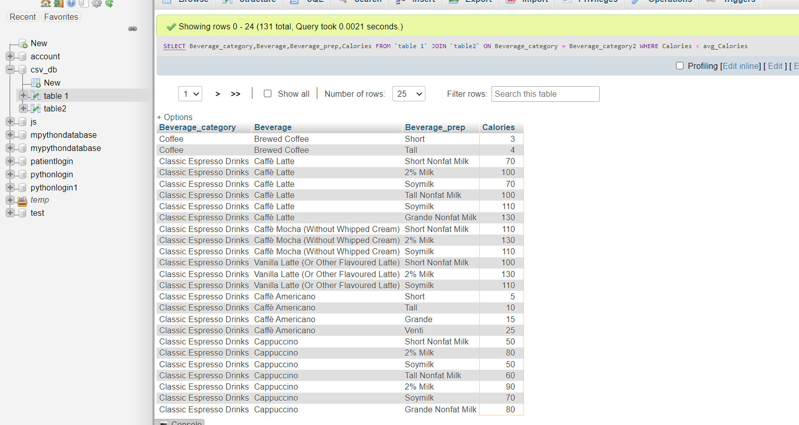

## firstly importing the csv file into MySQL using phpMyAdmin 

### the file saved with the name "table 1"

## 1- Which drink has the highest calories from the dataset ?

`
SELECT Beverage_category FROM `table 1` WHERE Calories = (SELECT MAX(Calories) FROM `table 1`)

#### Signature Espresso Drink with White Chocolate Mocha (Without Whipped Cream) ,2% Milk 

## 2-What is the average calorie amount for each drink category ?

`
SELECT Beverage_category, avg(Calories) FROM `table 1` GROUP BY Beverage_category
`

## 3-Which drinks have below average calorie amount ?

### firstly i inserted a table of the average calories (table2)

`
CREATE TABLE table2 AS SELECT Beverage_category, avg(Calories) FROM `table 1` GROUP BY Beverage_category
`

### then selct the values below the average of each category
`
SELECT Beverage_category,Beverage,Beverage_prep,Calories FROM `table 1` JOIN `table2` ON Beverage_category = Beverage_category2 WHERE Calories < avg_Calories
`

